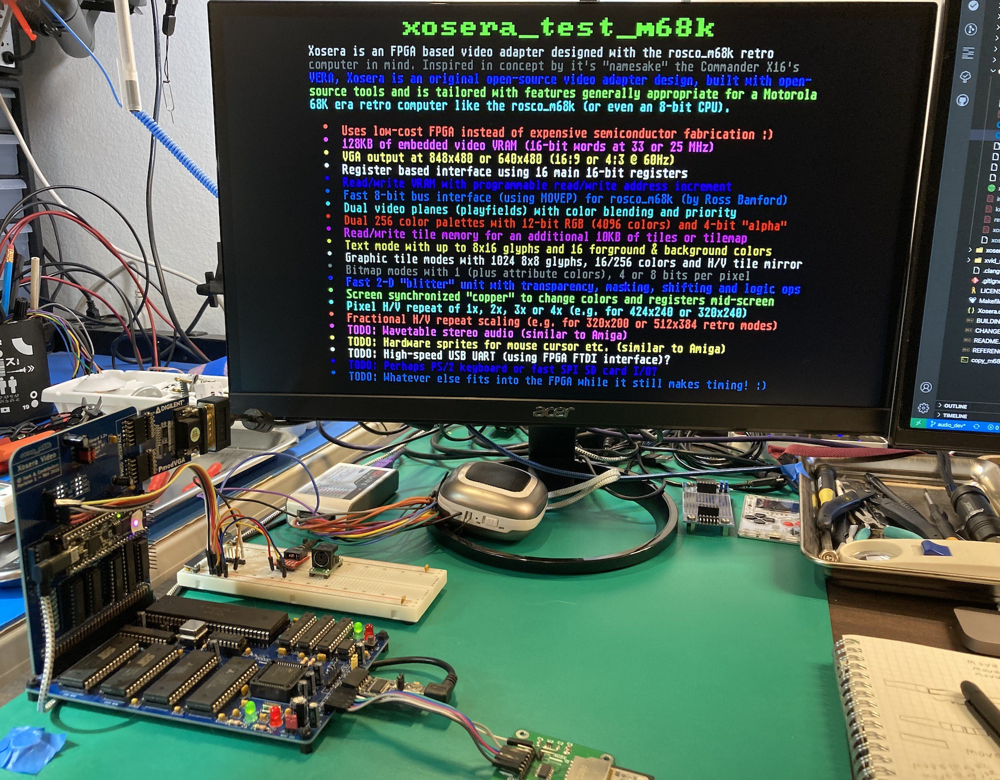
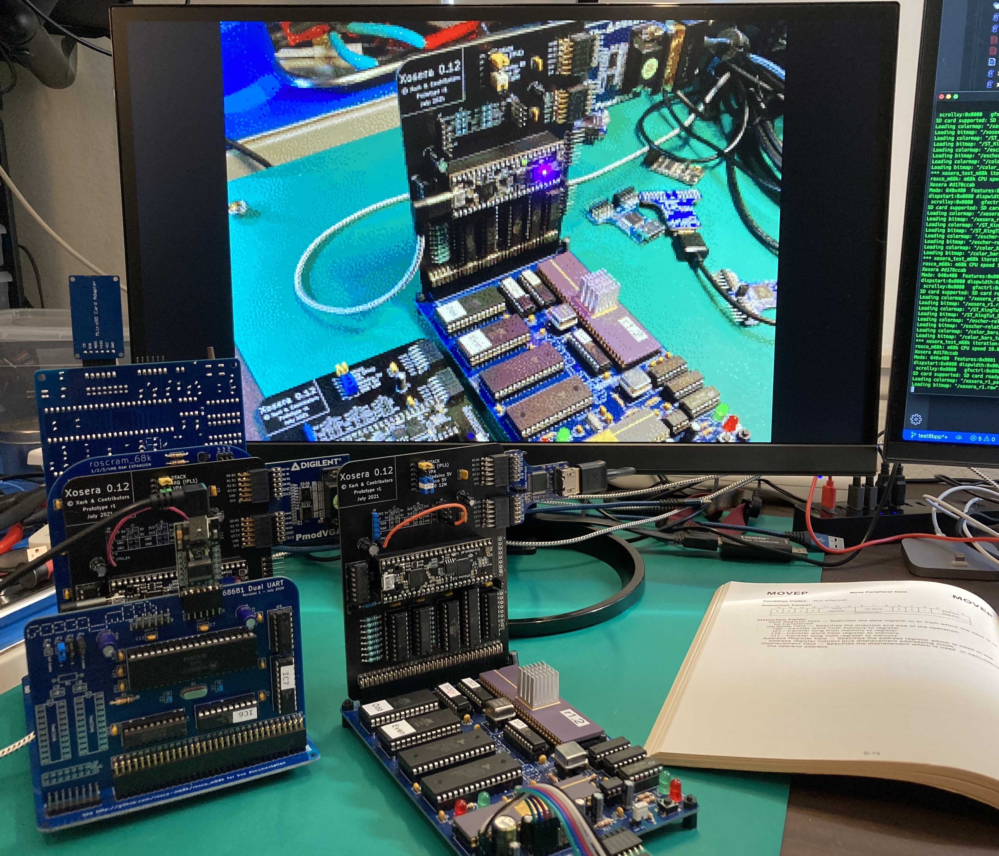
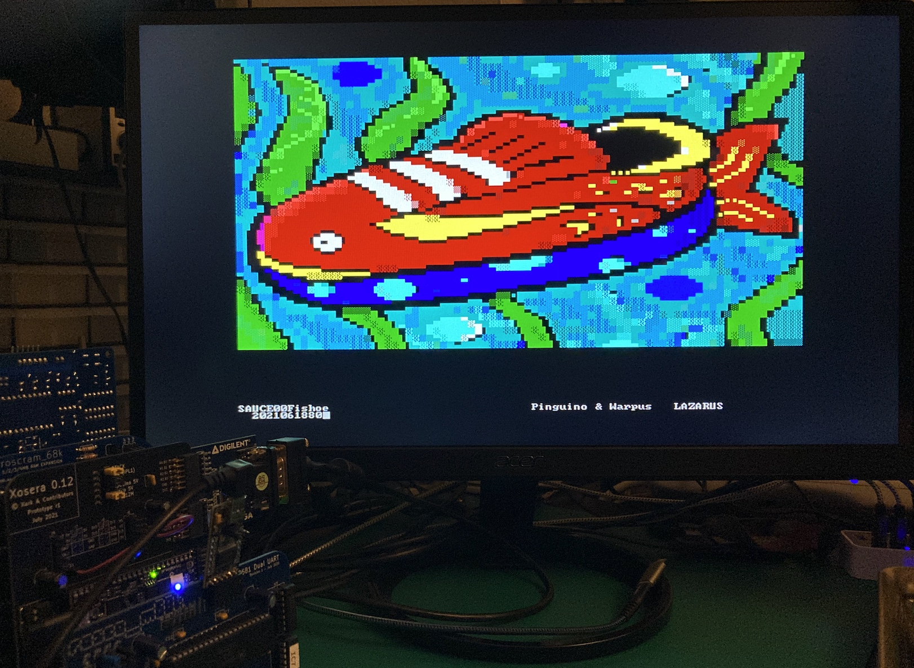
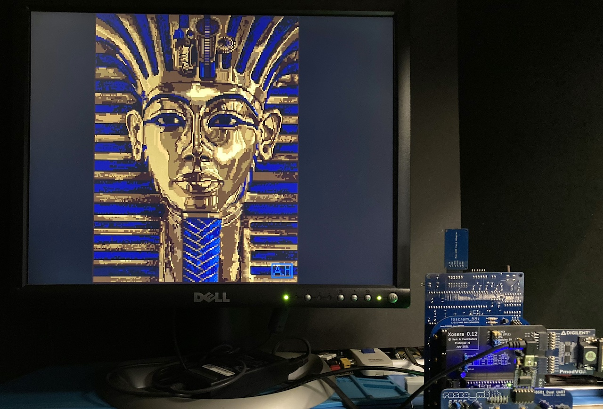

# Xosera - Xark's Open Source Embedded Retro Adapter

##### _"Not as clumsy or random as a GPU, an embedded retro video adapter for a more civilized age."_

### Xosera is an FPGA based video adapter designed with the [rosco_m68k](https://github.com/rosco-m68k/rosco_m68k) retro computer in mind (likely adaptable to most any computer with an 8-bit parallel bus and a few control signals)

Inspired in concept only by it's "namesake" the [Commander X16](https://www.commanderx16.com/)'s VERA, Xosera is an original open-source video adapter design, built with open-source tools, that is being tailored with features appropriate for a Motorola 68K era retro computer.

  
Picture of Xosera board in rosco_m68k undgoing audio development with logic-analyzer

Currently the design is using the [iCE40UP5K FPGA](https://www.latticesemi.com/en/Products/FPGAandCPLD/iCE40UltraPlus) which is fully supported by the open [Yosys/NextPNR tools](https://github.com/YosysHQ).  Development is now mostly on the Xosera board for the rosco_m68k system using [UPduino 3.x](https://github.com/tinyvision-ai-inc/UPduino-v3.0), but still builds for [iCEBreaker FPGA](https://github.com/icebreaker-fpga/icebreaker) board.

This is currently a work in progress, but you can follow along at [Hackaday.io](https://hackaday.io/Xark) or in the [rosco_m68k Discord](https://rosco-m68k.com/docs) (in the #xosera-developers or #xosera-users channel).  The design is largely complete, but still a few more features to hopefully squeeze in (and likely a few bugs and issues to investigate).

During development take everything here but the Verilog code with a grain of salt (i.e., the documentation may be out of date - or not written yet).  If you see an issue, feel free to make a pull request or ask on rosco_m68k Discord if you have a question (there are Xosera development and user channels).

While the FPGA design is adaptable, the current primary development focus is for rosco_m68k Xosera PCB, see [rosco_m68k Hardware Projects feature/xosera branch](https://github.com/rosco-m68k/hardware-projects/tree/feature/xosera) which is now available from [Tindie|(<https://www.tindie.com/products/rosco/xosera-fpga-video-r1/>) (thanks Ross 😃).

[See this for information on building and configuring Xosera](BUILDING.md)

Current Xosera features include:

**Main Xosera Features:**

- Uses low-cost FPGA instead of expensive semiconductor fabrication :D
- 128KB of embedded video VRAM (16-bit words at 25/33 MHz)
- CPU can read/write VRAM with separate read/write address and arbitrary increment
- VGA output at 640x480 4:3 or 848x480 16:9 wide-screen (both ~60 Hz)
- Pixel H/V repeat of 1x, 2x, 3x or 4x (e.g. for 320x240 or 424x240)
- Fractional H/V repeat scaling (e.g. for 320x200 or 512x384 retro modes)
- Dual independant video planes (playfields) with multiple 4-bit alpha blending modes
- Dual 256 color palettes with 12-bit RGB (4096 colors) and 4-bit \"alpha\" value
- Bitmap with 2 indexed colors (and attribute) as well as 16 and 256 indexed color modes
- Graphic tile modes with 1024 8x8 glyphs, 16/256 colors and H/V tile mirror
- VGA style text mode with 8x8 up to 8x16 font and 16 forground & background colors
- Bitmap and tilemap screens can be at any VRAM address and word width
- Smooth horizontal and vertical fine scrolling (at native pixel resolution)
- 4 voice 8-bit wavetable audio with stereo/panning using DMA (very similar to Amiga)
- Register based programming interface using 16 direct access 16-bit registers
- Additional indirect read/write registers allows easy access to more registers and memories
- Read/write tile memory for an additional 10KB of tile, tilemap or audio data
- Fast 2-D \"blitter\" unit with transparency, masking, shifting and logic ops (and queue to reduce idle time)
- Flexible screen synchronized \"copper\" CPU for pixel exact registers and memory modification
- External interupt generation from multiple internal sources (vsync, audio, blitter, timer etc.)
- 16-bit 0.1 ms free running timer and 8-bit interval timer with interrupt
- [Xosera PCB available for rosco_m68k](https://www.tindie.com/products/rosco/xosera-fpga-video-r1/) (from Ross Bamford), powered by [UPduino v3](https://tinyvision.ai/products/upduino-v3-1) FPGA board
- C API that provides easy low-level register access (and transforms into efficient inline 68K assembly code)
- Make based build using [YosysHQ OSS CAD Suite Builds](https://github.com/YosysHQ/oss-cad-suite-build/releases/latest) on Linux and macOS (and likely Windows with WSL2 or MSYS2)
- Fast Verilator simulation including SPI interface and using SDL2 for PNG screenshot of each video frame
- Icarus Verilog simulation and test bench

Planned Xosera features (TODO):

- DVI/HDMI output at 640x480@60Hz or 848x480@60Hz (16:9 widescreen 480p) using 1BitSquared DV PMOD (currently this _mostly works_, but is not 100% solid at this point - not exactly sure the issue).  It seems good testing design on iCEBreaker FPGA board.
- At least one "cursor" sprite above video playfields (and ideally more, probably with 16 or 256 colors)

  
A Self portrait picture of Xosera rendered in 320x240x8 bitmap mode

  
Rosco_m68k ANSI terminal firmware using Xosera to show ANSI art image

  
Picture of Xosera 16-color 320x200 test (classic Deluxe Paint image)
